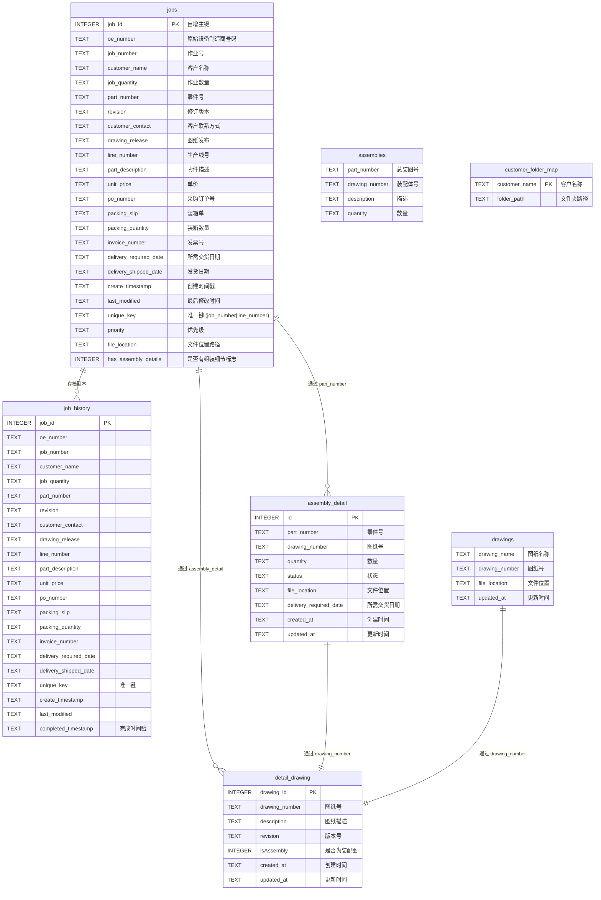

# 数据库结构可视化

以下是数据库结构的可视化表示，使用 Mermaid Markdown 描述表之间的关系：

```mermaid
erDiagram

    jobs {
        INTEGER job_id PK "自增主键"
        TEXT oe_number "原始设备制造商号码"
        TEXT job_number "作业号"
        TEXT customer_name "客户名称"
        TEXT job_quantity "作业数量"
        TEXT part_number "零件号"
        TEXT revision "修订版本"
        TEXT customer_contact "客户联系方式"
        TEXT drawing_release "图纸发布"
        TEXT line_number "生产线号"
        TEXT part_description "零件描述"
        TEXT unit_price "单价"
        TEXT po_number "采购订单号"
        TEXT packing_slip "装箱单"
        TEXT packing_quantity "装箱数量"
        TEXT invoice_number "发票号"
        TEXT delivery_required_date "所需交货日期"
        TEXT delivery_shipped_date "发货日期"
        TEXT create_timestamp "创建时间戳"
        TEXT last_modified "最后修改时间"
        TEXT unique_key "唯一键 (job_number|line_number)"
        TEXT priority "优先级"
        TEXT file_location "文件位置路径"
        INTEGER has_assembly_details "是否有组装细节标志"
    }

    job_history {
        INTEGER job_id PK
        TEXT oe_number
        TEXT job_number
        TEXT customer_name
        TEXT job_quantity
        TEXT part_number
        TEXT revision
        TEXT customer_contact
        TEXT drawing_release
        TEXT line_number
        TEXT part_description
        TEXT unit_price
        TEXT po_number
        TEXT packing_slip
        TEXT packing_quantity
        TEXT invoice_number
        TEXT delivery_required_date
        TEXT delivery_shipped_date
        TEXT unique_key "唯一键"
        TEXT create_timestamp
        TEXT last_modified
        TEXT completed_timestamp "完成时间戳"
    }

    detail_drawing {
        INTEGER drawing_id PK
        TEXT drawing_number "图纸号"
        TEXT description "图纸描述"
        TEXT revision "版本号"
        INTEGER isAssembly "是否为装配图"
        TEXT created_at "创建时间"
        TEXT updated_at "更新时间"
    }

    assembly_detail {
        INTEGER id PK
        TEXT part_number "零件号"
        TEXT drawing_number "图纸号"
        TEXT quantity "数量"
        TEXT status "状态"
        TEXT file_location "文件位置"
        TEXT delivery_required_date "所需交货日期"
        TEXT created_at "创建时间"
        TEXT updated_at "更新时间"
    }

    drawings {
        TEXT drawing_name "图纸名称"
        TEXT drawing_number "图纸号"
        TEXT file_location "文件位置"
        TEXT updated_at "更新时间"
    }

    assemblies {
        TEXT part_number "总装图号"
        TEXT drawing_number "装配体号"
        TEXT description "描述"
        TEXT quantity "数量"
    }

    customer_folder_map {
        TEXT customer_name PK "客户名称"
        TEXT folder_path "文件夹路径"
    }

    %% 表之间的关系
    jobs ||--o{ assembly_detail : "通过 part_number"
    jobs ||--o{ detail_drawing : "通过 assembly_detail"
    assembly_detail ||--|| detail_drawing : "通过 drawing_number"
    drawings ||--|| detail_drawing : "通过 drawing_number"
    jobs ||--o{ job_history : "存档副本"
```