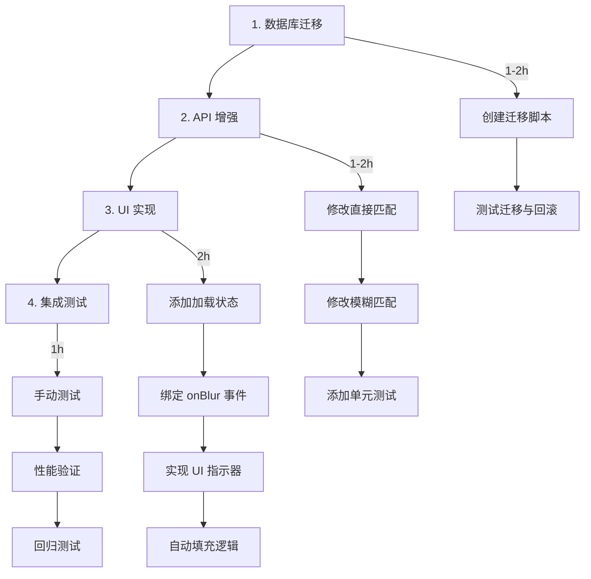

# Change: enhance-drawing-lookup-autocomplete

## 快速概览（Quick Overview）

**状态**: Proposal  
**创建日期**: 2025-12-27  
**预估工作量**: 4-6 hours

### 变更摘要

为 CreateJobModal 添加智能图纸检索与自动完成功能，包括：
1. drawings 表添加 `updated_at` 时间戳列
2. API 智能选择最新版本图纸
3. part_number 字段失焦触发自动检索

### 主要收益

- ⏱️ 减少用户手动输入时间 30-50%
- ✅ 降低文件位置错误率
- 🔄 为图纸版本管理奠定基础
- 📈 提升整体作业创建体验

## 文档导航（Documentation）

| 文档 | 描述 | 链接 |
|------|------|------|
| **Proposal** | 目标、动机、架构决策 | [proposal.md](./proposal.md) |
| **Design** | 详细技术设计与交互流程 | [design.md](./design.md) |
| **Tasks** | 实现任务清单与时间分配 | [tasks.md](./tasks.md) |
| **Specs** | 需求规范（3 个能力） | [specs/](./specs/) |

### 规范分解（Spec Breakdown）

1. **[drawing-timestamp](./specs/drawing-timestamp/spec.md)**  
   为 drawings 表添加时间戳追踪能力
   
2. **[drawing-api-selection](./specs/drawing-api-selection/spec.md)**  
   增强 API 的智能选择逻辑
   
3. **[part-autocomplete-ui](./specs/part-autocomplete-ui/spec.md)**  
   UI 层的自动完成交互

## 关键决策（Key Decisions）

### 时间戳类型

✅ **选择**: TEXT (ISO 8601)  
❌ **拒绝**: INTEGER (Unix timestamp)  
📝 **理由**: 与项目现有日期字段保持一致

### 触发时机

✅ **选择**: onBlur 事件  
❌ **拒绝**: 防抖 onChange  
📝 **理由**: 避免频繁请求，用户体验更流畅

### NULL 值处理

✅ **策略**: `ORDER BY updated_at IS NULL, updated_at DESC`  
📝 **效果**: 旧数据（NULL）排在最后，新数据优先

## 实施路径（Implementation Path）

## 风险矩阵（Risk Matrix）

| 风险 | 概率 | 影响 | 缓解措施 |
|------|------|------|----------|
| 迁移失败 | 低 | 高 | 测试数据库先验证 + 回滚脚本 |
| API 性能下降 | 低 | 中 | 后续添加索引优化 |
| 用户期望不符 | 中 | 低 | 加载指示器 + 允许手动修改 |

## 依赖关系（Dependencies）

### 前置依赖

- ✅ drawings 表结构
- ✅ drawing-file-location API
- ✅ CreateJobModal 组件

### 阻塞关系

无。此变更独立，可并行开发。

### 后续依赖

- 图纸版本管理系统（未来）
- 批量更新 updated_at 脚本（可选）

## 验收标准（Acceptance Criteria）

- [x] drawings 表成功添加 updated_at 列
- [x] API 返回最新图纸（基于 updated_at）
- [x] part_number 失焦自动触发检索
- [x] 检索时显示 CircularProgress
- [x] 所有现有测试通过
- [x] 迁移可正常执行与回滚

## 下一步行动（Next Steps）

### 批准前

1. ✅ 审查 proposal.md 与 design.md
2. ✅ 确认技术决策合理
3. ✅ 评估工作量与优先级

### 批准后（实施阶段）

1. 按 tasks.md 顺序执行
2. 每个阶段完成后更新状态
3. 完成后归档到 `changes/archive/`

## 参考资料（References）

### 项目文档

- [openspec/project.md](../../project.md) - 项目约定
- [data/structure.txt](../../../data/structure.txt) - 数据库结构
- [tasks/todo.md](../../../tasks/todo.md) - 当前任务清单

### 相关代码

- [src/pages/api/jobs/drawing-file-location.js](../../../src/pages/api/jobs/drawing-file-location.js)
- [src/components/modals/JobForm.jsx](../../../src/components/modals/JobForm.jsx)
- [scripts/migrate.js](../../../scripts/migrate.js)

### 相似变更

- [changes/archive/add-dynamic-customers-contacts](../archive/add-dynamic-customers-contacts/) - 参考案例

## 联系方式（Contact）

**提案作者**: AI Assistant  
**审核者**: （待指定）  
**实施者**: （待指定）

---

_This proposal was generated following OpenSpec conventions. See [openspec/AGENTS.md](../../AGENTS.md) for more information._
